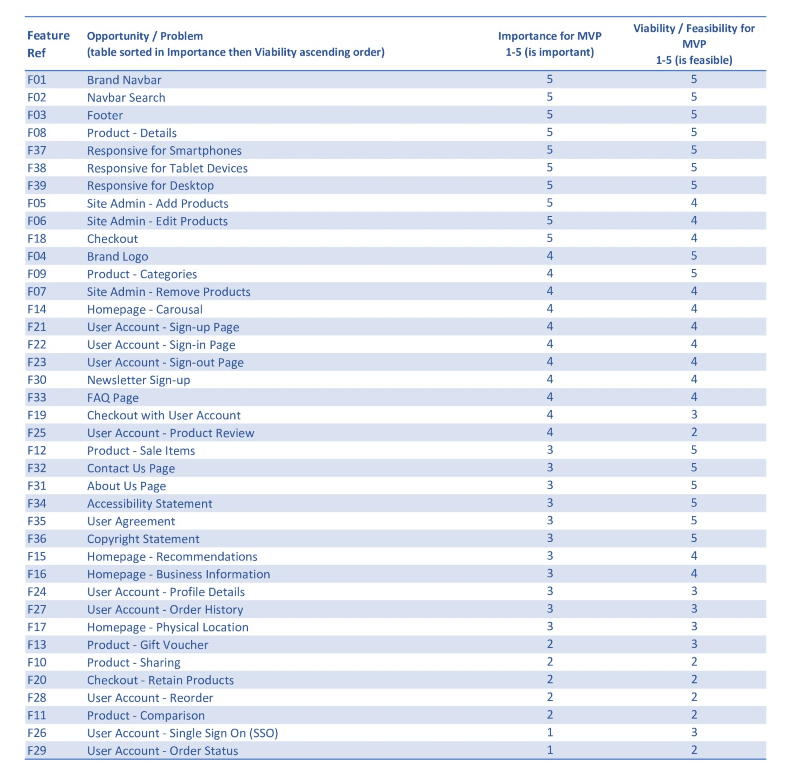
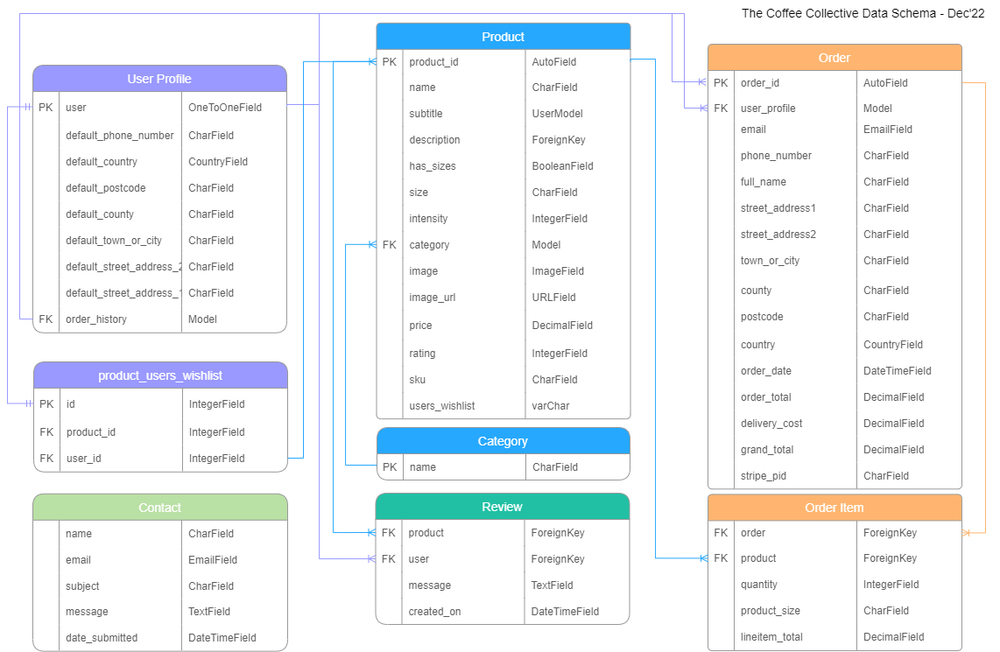

# The Coffee Collective

<p align="center">
        
    </p>

[Live Website](https://the-coffee-collective.herokuapp.com/)

[GitHub Repo](https://github.com/RickofManc/the-coffee-collective)


***


## Background

<br />

The Coffee Collective is a small family run coffee shop serving fresh coffee to city workers in Manchester. The family migrated from Italy in the 1970's and established a business that would allow them to use their knowledge and skills to help their new home. A cart was created and peddled to the city each morning to sell coffee to Mancunians. In the days before takeaway cups, customers stood and socialised whilst sipping their morning espressos and so became known to passers-by and onlookers as "the coffee collective".

***
<br />

## Index - Table of Contents

* [User Experience R&D](#user-experience-research-and-design)
    * [Strategy](#strategy)
    * [Scope](#Scope)
    * [Structure](#Structure)
    * [Skeleton](#Skeleton)
    * [Surface](#Surface)
* [Web Marketing Strategy](#Web-marketing-strategy)
* [Features](#Features)
* [Data Model](#Data-Model)
* [Testing](#Testing)
* [Deployment](#Deployment)
* [Credit & Attributes](#Credit-&-attributes)

<br />

***
<br />

## User Experience Research and Design

<br />

### Problem Statement

During the last forty years the family has diversified and setup a popular shop in the city where patrons still stand and socialise. The shop has become so popular that many coffee roasters provide bags of coffee for sale as some customers like to enjoy fresh coffee in work or at home. The COVID pandemic reduced the footfall considerably and whilst the cart was used for supplying coffee outside and socially distanced, the family know an e-commerce site would greatly help their financial stability. Furthermore, due to their popularity, the local coffee roasters would welcome the opportunity to sell their products through another channel.

<br />

### Objective

Understand the user requirements to enable development of a B2C web application that allows The Coffee Collective's customers to purchase coffee online with delivery to their chosen address. The e-commerce site will also allow the family to promote new stock lines such as coffee cups, coffee making equipment and clothing. Customers will have an option to create a user account to ease future transactions through saved details, view order history etc. All site visitors will have the opportunity to sign-up for latest news and promotions delivered monthly by email.

<br />

### Design Thinking

Following a design thinking approach and using the knowledge and experience of the Nielsen Norman Group, the following key personas have been used to empathize with and understand their needs.

<details><summary><b>User Personas</b></summary>
    <p align="center">
        
    </p>
</details><br />

The output from this phase supported the ideation of potential features and also the creation of User Stories complete with Acceptance Criteria and high-level tasks for the Development Phase. A [GitHub Projects Kanban Board](https://github.com/users/RickofManc/projects/5/views/1) has been used to manage and track all User Stories through to completion as workflow items. The archive section has been used as a Product Backlog for features that will be developed in the next release, and therefore brought onto the Release Backlog. Note this Kanban Board was also used for bug fixing and issue resolution, please see the Testing section of this document for further information.

The table below provide an overview of how the features are driving the epics, that in turn have been used to develop the user stories and tasks required to deliver the features.


<details><summary><b>Epics and User Stories Overview</b></summary>
    <p align="center">
        
    </p>
</details><br />

<br />

#### Strategic Opportunities

A list of features has been established from the User Stories. These features have been assessed using the MoSCoW method to understand which features are essential for the MVP and which could be re-prioritised for a future release. Following this assessment I looked at how feasible each of these features is to develop within the time frame. The chart below highlights the output from this evaluation. Overall this critical stage of analysis ensures the features that are available and will provide immediate user benefit, and in turn value for the business will be developed first.


<details><summary><b>MoSCoW Features Assessment</b></summary>
    <p align="center">
        
    </p>
</details><br />


<details><summary><b>Importance versus Feasibility Assessment</b></summary>
    <p align="center">
        
    </p>
</details><br />


<p align="center">
    
</p>

<br />

### Scope

An agile approach of keeping the features simple and aligned to the strategy for the MVP will be adopted. This will allow the business to understand which are driving benefit, and therefore should be developed further. Below is a list of the leading features for this project.


#### In Scope Features
* Responsive Navbar complete with product search, category menus, user account access.
* A streamlined checkout that is easy-to-edit and retains products between visits.
* Information about the business visible on the homepage, and a dedicated 'About' page.
* Optional user accounts with editable profile data, order history and the storing of shipping details.
* Registered users will be able to leave product reviews to help build trust in the products for new customers.
* Users can keep informed on products and news from the business through signing up to the newsletter.
* Free shipping on orders over £30.
* FAQ's to help the users navigation and experience of the site and service.
* Specific pages to inform users of the business' position Accessibility, Copyright etc.
* Clear Terms & Conditions.


#### Out of Scope Features - for future release
* Site visitors being able to compare products side by side.
* Realtime stock inventory updating the site when a product is out of stock.
* All site visitors should have an option to share a product listing via social media.
* A 10% discount code provided to those users signing up for the monthly newsletter.
* Single Sign-on to user accounts with social media logins.
* The status of a placed order with the users account area.
* Sale of e-vouchers to buy as gifts to be redeemed in the store.
* Country/Language switching for global shopping convenience.

<br />


### Structure

This website will be built with the following design considerations. The final structure for the MVP may differ slightly as development progresses from user feedback and testing.

* A hierarchal structure where the homepage will act as a landing pad with key links and useful information.
* The Navbar will provide menu buttons to the differing product categories.
* Each product category page will have the ability to filter the results. Clicking on a product will reveal further information about the product and provide the ability to add to bag.
* All of the above, and the user account, checkout, and business pages will be no more than 3 clicks away.
* The Navbar menu will be simple in design and layout, collapsing for mobile and tablet devices.
* Breadcrumbs will be added to the top of desktop pages allowing visitors to quickly navigate back to a previous section.
* A sitemap (available from the Footer) will display all the important categories and pages in a single page so users can find easily what they want.


<br />

### Skeleton

Key to meeting delivering for the differing user personas is a homepage that can immediately meet their priority requirements whilst not over complicating the UI with too much information, and too many choices. The hierarchal structure will be supported by the Navbar that within a click can navigated users to the main product categories. Similarly the homepage will host a carousel with a hero image enticing users who want to either find sale items, or learn more about the products.

The homepage will also act as the main point of navigation to allow users to learn more about the business, the benefits of coffee and links to useful resources i.e. FAQ's.

Aesthetically the layout and content will be clean and clear to promote the products and different areas of the site.

In building the skeleton I used Wireframes to enable the client to feedback on how their site will look and interact ahead of development.

<br />

**Keyword Research**

Ahead of creating the Wireframes, I performed keyword research to understand what topics and categories users are searching for when they come to shop for fresh coffee and coffee related products online. First I brainstormed general coffee topics to ascertain some keywords, and followed this by researching these words using Amazon to understand potential short-tail and long-tail keywords. Using [wordtracker.com](https://www.wordtracker.com/) I evaluated which would be competitive, relevant, authoritative and trustworthy. 

The output highlighted below helped with the naming conventions and descriptions for the products and page URLs to improve site searchability.

**_Short-tail Keywords_**
* Coffee beans
* Fresh coffee
* Ground coffee
* Coffee machines
* Coffee mug
* Coffee cup
* Coffee grinder

**_Long-tail Keywords_**
* Fresh coffee beans 1kg
* Fresh coffee beans
* Fresh coffee ground
* Fresh coffee maker
* Fresh coffee machine
* Coffee clothing for men
* Coffee lover clothing
* Coffee barista apron
* Café aprons for women coffee bean design
* Waist apron coffee shop
* Cafetiere 8 cup
* Cafetiere 2 cup
* Cafetiere coffee ground
* Fresh coffee beans near me
* How to make fresh coffee
* Buy coffee beans online
* Locally roasted coffee near me

<br />

#### Wireframes

As part of this phase wireframes for desktop and mobile devices have been produced using Balsamiq (see images below - the wireframe files are located with the project [GitHub Repo](https://github.com/RickofManc/the-coffee-collective)). I focused on mocking up the main layouts; the homepage, a page with multiple products and a detailed view of a product.

The website is responsive through differing screen widths being designed for mobile first to a max-width of 767px. Tablets are responsive from 768px through to 1023px, laptops from 1023-1440px, and desktops from 1440px upward.


<details>
    <summary><b>Homepage Wireframe</b></summary>
    <p align="center">
        
    </p>
</details><br />

<details>
    <summary><b>Products Page Wireframe</b></summary>
    <p align="center">
        
    </p>
</details><br />

<details>
    <summary><b>Product in Detail Page Wireframe</b></summary>
    <p align="center">
        
    </p>
</details><br />

<br />

### Surface

In consideration that accessibility is a key design criteria, the visual language offers contrast using a simple colour palette, readable font and clear layout. Throughout the website this language has been applied consistently to promote intuitive behaviour with the most important links and information easily recognised. The differing aspects of the Surface are described below.


#### Colour

This palette has been carefully selected to bring high contrasting colours to improve accessibility to visually impaired users. As the primary aim of the site is to inform and in turn promote, Black text on a White background is adopted throughout. Purple has been chosen as conventionally this represents luxury and glamour within e-commerce. As the products being sold are aimed at users who can afford fresh coffee at home, or potentially as a gift, Purple should help to being a special feel to their experience.

Purple has been offset with some softer Grey tones to ensure where necessary information within Purple sections stands out and entices users.

<p align="center">
    
</p>

<br />

The mock-up's enabled me to work through differing layout styles with this colour palette in mind, whilst using [Contrast Checker](https://coolors.co/contrast-checker) to test whether the combinations of colours would be accessible for visual impaired users. The main Purple tone was evaluated as 'Super' whilst the slightly lighter shade will be used for larger text areas as guided.

<details>
    <summary><b>Colour Palette Contrast Checker</b></summary>
    <p align="center">
        
    </p>
</details>
<br />


#### Fonts

Google Fonts has been used to provide free fonts for commercial use. The fonts selected have been chosen for differing reasons whilst still complementing each other. 
Firstly, a strong bold font has been selected in 'Bebas Neue' for titles and subtitles to be impactful for a few words. Whereas 'Open Sans' will be used for body text at a conventional 16px as by design the font is clear and accessible for paragraphs as well as being legible for numbers and symbols.


<p align="center">
    
</p>

<br />


***

<br />

## Web Marketing Strategy

Building on the insights gained as part of the Design Thinking phase and Keyword research as part of the Skeleton phase, I've introduced specific features to market the business. The primary aim of which is to optimise search engine ranking and in turn increase traffic to the website.


### Search Engine Optimisation (SEO)

SEO research is key to driving traffic from a browser based search i.e. Google to the website. The keyword research (see Skeleton section) has played a crucial role in incorporate words that users typical search for when looking to purchase coffee online. To help improve the search engine ranking I ensured each web page has it's own title, and the site carries meta tags for a description and keywords which encapsulate the general content and focus of this B2C site.


### XML Sitemap 

Additionally to help the search engines crawl the website, I have created an XML sitemap file which has been located within the site repo. The file was created using the free service through [XML-Sitemaps.com](https://www.xml-sitemaps.com/). A sitemap is a way of organizing a website, identifying the URLs and the data under each section. Previously, the sitemaps were primarily geared for the users of the website. However, Google's XML format was designed for the search engines, allowing them to find the data faster and more efficiently.

A robots.txt file has also be included in the build to tell the search engine crawlers which URLs the crawler can access on this site. This is used mainly to avoid overloading the site with requests.


### MailChimp Newsletter

To allow the business to communicate with their customers to promote products and events through digital marketing, I've partnered with MailChimp. This is initially a free service with MailChimp to collect customers email addresses. The business can then construct the newsletter using MailChimp's online service. The feature is located on the Homepage, offering an opportunity for customers to enter their address to subscribe. Once the email address is submitted a success message is presented to thank them for signing up.

<details>
    <summary><b>MailChimp</b></summary>
    <p align="center">
        
    </p>
</details><br />


### Coffee Shop Location

I've utilised Google Maps within an iframe on the Homepage to promote the physical store location as a build to how customers can purchase and experience the businesses coffee and relating products.

<details>
    <summary><b>Google Maps</b></summary>
    <p align="center">
        
    </p>
</details><br />


### Facebook Page

To further increase traffic to the website, a Facebook page has been created that will display information about the products and family run business.

<p align="center">
    
</p>

<br />


***

<br />

## Features

This section will outline the key features deployed as part of the MVP. Further information of how these features were selected and what is in scope for future releases can be found in the 'Strategic Opportunities' section.

<br />


### Brand Navbar and Navbar Search

Using a customised Bootstrap 4 'Brand Navbar' I have implemented a fixed navbar that remains at the top of all pages all of the time. This allows users to easily move between pages using the drop down menu's or directly clicking Search, My Account or their Bag.

<p align="center">
    
</p>

<br />

The navbar is responsive, collapsing to a conventional burger menu on mobile devices.

<p align="center">
    
</p>

<br />


### Homepage 

The homepage carries several features from enticing imagery through the carousal complete with links to products, key information about the physical coffee shop location, an introduction to the owners and an optional sign-up to a newsletter.

<br />

<p align="center">
    
</p>

<br />


### Footer

The footer offers a contrasting colour theme from the navbar to support users navigation in distinguishing the top from the bottom of the website. The footer is available on all site pages to enable quick access to key information to improve the users journey and promote the businesses socials.

<p align="center">
    
</p>

<br />


### Brand Logo

I've opted not incorporate the logo within the navbar as the font choice provides impact given the contrasting colours. The logo has been used as the favicon and is available for other areas of the site as it develops. The choice of font has been carried through to the labelling of the hand roasted coffee to provide a consistent and trusting feel for users.

<p align="center">
    
</p>

<br />


### Products & Customers Reviews

Using a Bootstrap Grid, the products are set out in rows with each product aligned to a card. The card provides brief info with users able to find out more from either conventionally clicking on the image or by the 'Learn More' button in case the image does not load. 

<p align="center">
    
</p>

<br />


Clicking through provides more information on the specific product with options to add the item to their bag. Size options are also visible on this page.
This page also promotes feedback from users through 'Customer Reviews'. Only users who are registered can leave a review so there is a handy link to encourage this feature. Reviews are published immediately to provide a feeling of success to the user. The business assess reviews regularly to ensure there is nothing inflammatory - at which point they could be deleted through Django Admin.

<p align="center">
    
</p>

<br />


### Bag

The bag page provides an overview of all of the items added by the user. The information aims to confirm what the user has selected with a table of information about the product and a supporting image. The price of all items is calculated and provided as a 'subtotal' with the delivery charge (if applicable). Users can amend the quantity of a product or remove entirely from the basket before proceeding the to the secure checkout. Furthermore there is a button to enable the user to 'Keep Shopping' to add further items to their bag.

<p align="center">
    
</p>

<br />


### Checkout

This page enables the user to complete their transaction. As with the bag page it is separated into two sections, delivery and billing details, and an overview of the items being purchased. Placeholder text is provided to ease the users journey.

Stripe payments have been integrated to manage transactions and collect payment. For the MVP test payments have been enabled using the following card details.

| CARD NO             | MM / YY | CVC | Post Code |
| ------------------- | ------- | --- | --------- |
| 4242 4242 4242 4242 | 04 / 24 | 242 | 42424     |


<p align="center">
    
</p>

<br />

Upon completion of the transaction, users are automatically navigated to the checkout success page (below) which provides a confirmation of the items purchased, with the added comfort of the confirmation being emailed to the address provided.

<p align="center">
    
</p>

<br />


### User Profile

Accessed through the 'My Account' link in the navbar, a registered and signed-in user can update their saved delivery details and view order history. Each transaction is a row with a table. The 'Order Number' can be clicked to open the order confirmation page.

<p align="center">
    
</p>

<br />


### Contact

Users can contact the business via a form that can be navigated to either directly from the footer, or through the 'About' drop down menu within the navbar.
In attempt to answer and questions or concerns as quick as possible, users are encouraged to first visit the FAQs page to see whether the question has already been answered
If not, a short and simple form can be completed and submitted.  

<p align="center">
    
</p>

<br />

When the user submits the form, feedback is provided through a success message confirming receipt of the form.

<p align="center">
    
</p>

<br />


### FAQs


<br />


### Company Information


<br />


### Admin


<br />


##### Product Management


Add

Edit

Delete


<br />


### Error Pages

To support user navigation should they experience an error, I have included custom 403, 404, 500 and 505 pages so users can easily navigate back to the homepage.


***

<br />

## Data Model

As part of the project planning phase a high-level design of the site [structure](#Structure) has been created to understand the main entities, and the relationship between these entities set within a Hierarchical structure.
This led to understanding the next level down through mapping out the tables, columns and attributes required for the database. The initial draft in Excel has been mapped into a data schema below using [draw.io](https://www.draw.io/index.html) to help understand how the entities and data will relate across the site.

In consideration of the a requirement for the data to be searchable, and in time understand patterns and trends in user behaviour, an Object-Relational Database using MVT architecture has been selected. I've opted for a PostgreSQL DBMS (Database Management System) as it can support the aforementioned requirements, PostgreSQL can also support multiple programming languages and libraries that which will be used to build the application.

The diagram below shows the entity relationships between categories, products, product reviews, users, and an order. The Product Model is used by the Review Model to ensure the right product is being reviewed. The diagram also highlights that one product can have many reviews. 

The key component in this relationship is the user. I have used the default Django User Model with customisations for simplicity. Both the user and product models are used by Order and Order Line Item models (as users have an option to checkout as a user or as guest).

With this architecture a user can add many products to one order, and leave many product reviews. 

There are currently seven categories created within Category table. These are used to group the products and can be accessed from the navigation menu. They can managed through the Django admin panel, along with user data, products, reviews and orders. 

<br />

The diagram highlights the following relationships:
* One product can have many reviews
* One product can have one category
* One category can have many products
* One order can have many products
* One user can have one order
* One user can add a review to many products
* One user can add many reviews to one product


The Contact Model (within the Company App) does not have a relationship with the other apps, however I have included for awareness towards future development.

 
<p align="center">
    
</p>

<br />


### Data Security

Specific steps have been taken to ensure the security of users data and the websites integrity. These are as follows;
* The use of an env.py file to store key variables for accessing secure environments i.e. Postgres Database.
* A gitignore file has been incorporated to ensure the env.py file is never committed to production. Therefore retaining the security of these key variables.
* Additionally, these variables are stored within the Config Variables in Heroku to ensure GitPod and Heroku can synchronise securely.
* Cross Site Request Forgery (CSRF) tokens have been applied to all HTML Forms. Their application provides protection from malicious attacks where users maybe performing certain actions or sending data when logged-in.
* Django's inbuilt User Authentication has been applied to several key areas to ensure only authenticated users can add reviews. A further layer of security has been applied to ensure the ability to manage products (Create, Update, Delete) in the front end can only be performed by users with 'Admin' status.


### Meta data

Meta data is included within the HTML head element to increase the traffic to the website. Additionally, site pages are titled appropriately as another method of informing users of their location.


***

<br />

## Technologies


### Languages

* HTML5
* CSS3
* Python
* JavaScript


### Frameworks & Libraries

* [Django 3.2](https://docs.djangoproject.com/en/4.0/releases/3.2/) has been adopted as more preferable over the newest beta Django 4 to rapidly and securely develop this application.
* [dj_database_url](https://pypi.org/project/dj-database-url/) library used to allow Database urls to connect to the Postgres database.
* [Psycopg2](https://pypi.org/project/psycopg2/) supports the connection to the Postgres database.
* [Gunicorn](https://gunicorn.org/) was used as the Web Server to run Django on Heroku.
* [Django-allauth](https://django-allauth.readthedocs.io/en/latest/) used for addressing user authentication, registration and account management.
* [Bootstrap4](https://getbootstrap.com/docs/4.6/getting-started/introduction/) was used to build responsive web pages.
* [Crispy Forms](https://django-crispy-forms.readthedocs.io/en/latest/) is simplifying rendering on several forms.
* [Font Awesome](https://fontawesome.com/icons) source of all site icons.
* [Bulma](https://bulma.io/extensions/) used to support the line height of Font Awesome icons.
* [Pillow](https://pillow.readthedocs.io/en/stable/) to support image processing capabilities.


### Software & Web Applications

* [Balsamiq](https://balsamiq.com/) to build wireframes for the Skelton phase.
* [Figma](https://www.figma.com/) for the high-level site structure.
* [draw.io](https://www.draw.io/index.html) to diagram data schema/model.
* [Photopea](https://www.photopea.com/) to create the clothing product images and brand logo.
* [CovertCSV](https://www.convertcsv.com/csv-to-json.htm) used to convert the csv files with products and categories to json for importing to the repo.
* [GitPod](https://gitpod.io/) used for the IDE and [GitHub](https://github.com/) as a hosting repository.
* [Google Developer Tools](https://developers.google.com/web/tools/chrome-devtools) Used as the primary method for developing the sites responsiveness and identifying bugs.
* [GitHub Kanban board](https://github.com/users/RickofManc/projects/5/views/1) adopted for managing and tracking the user stories using the kanban agile methodology.
* [Heroku](https://dashboard.heroku.com/) to host the live website, including database.
* [Kaffeine](https://kaffeine.herokuapp.com/) used to ping the Heroku every 30 minutes to ensure the website doesn't go to sleep, ensuring fastest load times.
* [AWS](https://aws.amazon.com/) used to store media files.
* [Stripe](https://stripe.com/gb?utm_campaign=paid_brand-UK_en_Search_Brand_Stripe-2032860449&utm_medium=cpc&utm_source=google&ad_content=604272871169&utm_term=stripe&utm_matchtype=e&utm_adposition=&utm_device=c&gclid=Cj0KCQjw166aBhDEARIsAMEyZh5nI26c2sSyFBiwTN1FZ35IpJyD3FJbthyXoAWkHhAYl8tT-Oru8aUaAtVyEALw_wcB) used to receive customer payments.
* [Wave](https://wave.webaim.org/) - Accessibility Testing to ensure content is readable for all users.
* [HTML Validator](https://validator.w3.org/) validates HMTL code.
* [W3 CSS Validator](https://jigsaw.w3.org/css-validator/validator) validates CSS code.
* [PEP8 Validator](http://pep8online.com/)  validates Python code.
* [JSHint](https://jshint.com/) validates JavaScript code.
* [Code Beautify](https://codebeautify.org/) validates the code formatting for browser reading.
* [IE NetREnderer](https://netrenderer.com/index.php) for cross browser testing, specifically Microsoft IE versions 11 and Edge.
* [LambdaTest](https://www.lambdatest.com/) for cross browser testing, specifically macOS Safari and Opera.


***

<br />

## Testing


***

<br />

## Deployment

This project was deployed using the steps below with version releasing active. Please do not make any changes to files within this repository as any changes pushed to the main branch will be automatically reflected on the live website. Instead, please follow the steps below which guide you to forking the website where changes can be made without impact to the live website. Thanks!


### Fork and Deploy Locally with GitHub

<details>
    <summary></summary>

To fork this website to either propose changes or to use as an idea for another website, follow these steps:
1. If you haven't yet, you should first set up Git. Don't forget to set up authentication to GitHub.com from Git as well.
1. Navigate to the [The Coffee Collective](https://the-coffee-collective.herokuapp.com/).
1. Click the 'Fork' button on the upper right part of the page. It's in between 'Watch' and 'Star'.
1. You will now have a fork of 'The Coffee Collective' repository added to your GitHub profile. Navigate to your own profile and find the forked repository to add the required files.
1. Above the list of forked files click the 'Code' button.
1. A drop-down menu will appear providing a choice of cloning options. Select the one which is applicable to your setup.
</br>
Further details on completing the last step can be found on GitHub's [Fork a Repo](https://docs.github.com/en/get-started/quickstart/fork-a-repo) page

To deploy locally with GitHub, follow these steps:
1. Log into your GitHub repository, create a GitHub account if necessary
1. Click 'Settings' in the main Repository menu
1. Click 'Pages' from the left-hand side navigation menu
1. Within the Source section, click the "Branch" button and change from 'None' to 'Main'
1. The page should automatically refresh with a url displayed
1. Test the link by clicking on the url
1. From this point you can push code to this page using the following steps from with GitPod;
    1. With the application open, open the command line terminal (CLI)
    1. Stage any changes using the command 'git add .' or by specifying the file with changes i.e 'git add settings.py'
    1. Commit the changes to GitHub by adding a commit message describing the changes i.e. 'git commit -m "Update docbook dependency and generate epub"
    1. Finally add the command 'git push' which will push all the code to GitHub. You can view the deployed code using the url generated within the steps above.
    1. Additionally if you would like to run the application locally pre/post any changes, from the terminal type 'python3 manage.py runserver'.
    1. A dialog box should open asking you to open port 8000, click 'Open' and navigate to the opened tab/window which should allow you to view the running application.
    1. If the dialog box does not automatically appear, find the 'Remote Explorer' section of the left hand navbar within GitPod and click on the port '8000' and the internet/globe icon to the right which should open the running application.
</details>


### Gmail SMTP

<details>
    <summary></summary>

Gmail SMTP has been used to send order confirmations and user contact emails in the deployed version. To use this configuration, copy and adapt the code below into your settings.py file.

```
if 'DEVELOPMENT' in os.environ:
    EMAIL_BACKEND = 'django.core.mail.backends.console.EmailBackend'
    DEFAULT_FROM_EMAIL = '(ADD YOUR EMAIL ADDRESS)@gmail.com'
else:
    EMAIL_BACKEND = 'django.core.mail.backends.smtp.EmailBackend'
    EMAIL_USE_TLS = True
    EMAIL_PORT = 587
    EMAIL_HOST = 'smtp.gmail.com'
    EMAIL_HOST_USER =  os.environ.get('EMAIL_HOST_USER')
    EMAIL_HOST_PASSWORD = os.environ.get('EMAIL_HOST_PASS')
    DEFAULT_FROM_EMAIL = os.environ.get('EMAIL_HOST_USER')
```
</details>


### Amazon Web Services (AWS) Storage

<details>
    <summary></summary>
Considering the development of the site could require a significant volume of product images, AWS has been used as the cloud host for imagery. To implement this you will need and AWS account and to create an S3 Bucket and User Profile. Developer guidance can be followed on AWS's site.

To serve the images you will need to add the following config to your settings.py file.

```
if 'USE_AWS' in os.environ:
    # Cache control
    AWS_S3_OBJECT_PARAMETERS = {
        'Expires': 'Thu, 31 Dec 2099 20:00:00 GMT',
        'CacheControl': 'max-age=94608000',
    }
    # Bucket config
    AWS_STORAGE_BUCKET_NAME = 'the-coffee-collective'
    AWS_S3_REGION_NAME = 'eu-west-2'
    AWS_ACCESS_KEY_ID = os.environ.get('AWS_ACCESS_KEY_ID')
    AWS_SECRET_ACCESS_KEY = os.environ.get('AWS_SECRET_ACCESS_KEY')
    AWS_S3_CUSTOM_DOMAIN = f'{AWS_STORAGE_BUCKET_NAME}.s3.amazonaws.com'
    # Static and media files
    STATICFILES_STORAGE = 'custom_storages.StaticStorage'
    STATICFILES_LOCATION = 'static'
    DEFAULT_FILE_STORAGE = 'custom_storages.MediaStorage'
    MEDIAFILES_LOCATION = 'media'
    # Override static and media URLs in Production
    STATIC_URL = f'https://{AWS_S3_CUSTOM_DOMAIN}/{STATICFILES_LOCATION}'
    MEDIA_URL = f'https://{AWS_S3_CUSTOM_DOMAIN}/{MEDIAFILES_LOCATION}'
```
</details>


### Stripe

<details>
    <summary></summary>

Stripe has been used to receive payments from customers. To implement you need to have an account with Stripe and follow the [documentation](https://stripe.com/docs) add incorporate the guided HTML, Python and JavaScript code. Be sure to add the secret key generated with Stripe to your Heroku Config Variables.

Once Stripe is activate you can test the checkout process with a test credit card detail provided by Stripe. Please use these details (below) and not real card details as there is no guarantee monies can be returned as this is a fictitious site.

| CARD NO             | MM / YY | CVC | Post Code |
| ------------------- | ------- | --- | --------- |
| 4242 4242 4242 4242 | 04 / 24 | 242 | 42424     |

</details>


### Deploy with Heroku

<details>
    <summary></summary>

1. Log in to Heroku at https://heroku.com - create an account if needed.
1. From the Heroku dashboard, click the Create new app button. For a new account an icon will be visible on screen to allow you to Create an app, otherwise a link to this function is located under the New dropdown menu at the top right of the screen.
1. On the Create New App page, enter a unique name for the application and select region. Then click Create app.
1. On the Application Configuration page for the new app, click on the Resources tab.
1. In the Add-ons search bar enter "Postgres" and select "Heroku Postgres" from the list - click the "Submit Order Form" button on the pop-up dialog.
1. Next, click on Settings on the Application Configuration page and click on the "Reveal Config Vars" button - check the DATABASE_URL has been automatically set up.
1. Add a new Config Var called DISABLE_COLLECTSTATIC and assign it a value of 1 - Remove this when releasing for Production.
1. Add a new Config Var called SECRET_KEY and assign it a value - any random string of letters, digits and symbols.
1. The settings.py file should be updated to use the DATABASE_URL and SECRET_KEY environment variable values as follows :

        DATABASES = {'default': dj_database_url.parse(os.environ.get('DATABASE_URL'))}

        SECRET_KEY = os.environ.get('SECRET_KEY')

1. In Gitpod, in the project terminal window, to initialize the data model in the postgres database, run the command : python3 manage.py migrate
1. Update the requirements.txt file with all necessary supporting files by entering the command : pip freeze > requirements.txt
1. Commit and push any local changes to GitHub.
1. In order to be able to run the application on localhost, add SECRET_KEY and DATABASE_URL and their values to env.py

Connect GitHub Repo to Heroku App

1. Navigate to Application Configuration page for the application on Heroku and click on the Deploy tab.
1. Select GitHub as the Deployment Method and if prompted, confirm that you want to connect to GitHub. Enter and search for the required repository, then click on Connect to link them up..
1. Scroll down the page and choose to either Automatically Deploy each time changes are pushed to GitHub, or Manually deploy - I chose the latter for the initial deployment to watch the build and then opted for Automatic Deployment.
1. The application can be run from the Application Configuration page by clicking on the Open App button.
1. Each time you push code from your GitHub Repo it will be automatically reflected in your Heroku App.

The url for this website can be found here https://the-coffee-collective.herokuapp.com/
</details>


### Pre Production Deployment

<details>
    <summary></summary>

When you are ready to move to production, the following steps must be taken to ensure your site works correctly and is secure.

In GitPod:
1. Set DEBUG flag to False in settings.py
1. Check the following line exists in settings.py: X_FRAME_OPTIONS = 'SAMEORIGIN'
1. Update the requirements.txt file with all necessary supporting files by entering the command : pip freeze > requirements.txt
1. Commit and push code to GitHub
In the Heroku App:
1. Settings > Config Vars : Delete environment variable : DISABLE_COLLECTSTATIC
1. Deploy : Click on deploy branch
</details>
    

***

<br />


***

<br />

## Credit & Attributes


### Credit & Thanks

* Mentor Brian Macharia for continuing to guide and feedback throughout the projects lifecycle, especially on how to improve UX and my code through what has been a very challenging and difficult project to undertake.


### Attributes

Support with how to develop ideas into code also came from various online resources, as well as using open source code and free images. All these are documented below.

* In general the coding and testing has relied on the Code Institutes walkthrough project "Boutique Ado", with customisations to bring in information about the business and how to contact TCC. Additionally, users can add product reviews, as well as the products containing some differing attributes from the walkthrough project.
* [W3schools](https://www.w3schools.com/) as a source of 'How to...' information throughout the build, and specifically on adapting the Bootsrap NavBar to have a [burger menu icon](https://www.w3schools.com/howto/howto_css_menu_icon.asp) for mobile devices
* [Django Project Docs](https://docs.djangoproject.com/en/4.0/ref/models/fields/) were referenced many times, especially in how to reference fields correctly across differing python files.
* [Ordinary Coders](https://ordinarycoders.com/blog/article/add-a-custom-favicon-to-your-django-web-app) guided me on how to create and add a customised favicon.
* [Monica Wheeler](https://codepen.io/frogmcw/pen/deqRwa) for the code to build the FAQs feature, Union Roasted Coffee provided inspiration for some of the typical questions users may ask.
* [RocketLawyer](http://rocketlawyer.com/) for free creation of a basic Terms & Conditions document.

#### Images

* Photo of Lorenzo Ferodo by Andrea Piacquadio on [Pexels](https://www.pexels.com/)
* Photo of Luca Ferodo by Apunto Group Agencia on [Pexels](https://www.pexels.com/)
* Photo of Coffee Shop interior by Dmitry Zvolskiy on [Pexels](https://www.pexels.com/)
* Favicon from Vecteezy by [icon0.com](https://www.vecteezy.com/free-png/coffee-bean)
* HTML Background sourced from Pexels by [Engin Akyurt](https://www.pexels.com/photo/photo-of-a-black-mug-on-top-of-brown-coffee-beans-9899791/)
* Image of Barista Aprons from [Zazzle](https://www.zazzle.co.uk/barista+aprons)
* Images of Moka Pots from [Bialetti](https://www.bialetti.com/it_en/)
* Images of Cafetieres from [Olympia](https://www.nisbets.co.uk/olympia-contemporary-cafetiere-black-8-cup/cw951)
* Images and descriptions of Coffee Cups from [Gimoka](https://cafazzini.co.uk/collections/all/italian-coffee-cups)
* Inspiration on coffee sizing and prices from [Cafazzini](https://www.gimokacoffee.com/)
* Adobe Stock was used for clothing images under licence.


